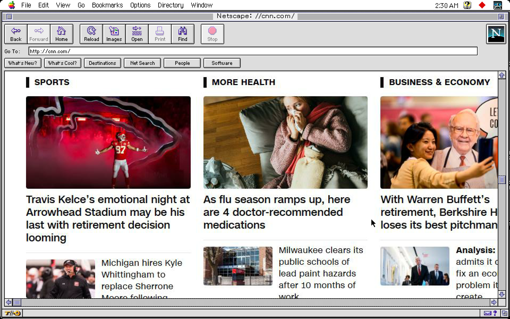
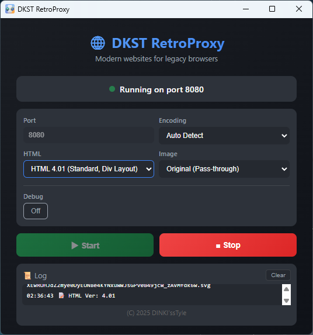
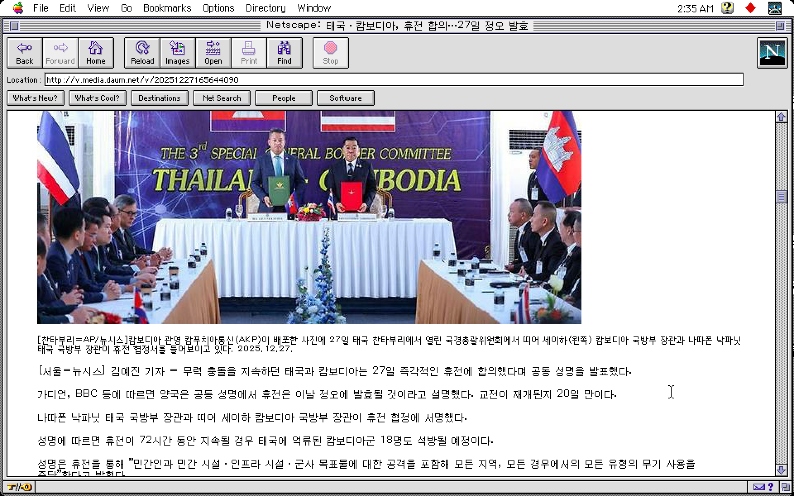
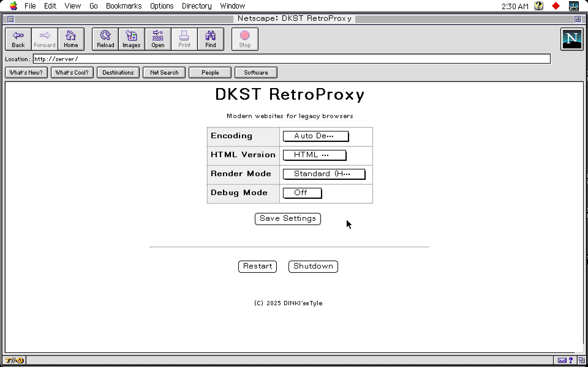

# DKST RetroProxy
> **Modern websites for legacy browsers**

<p align="center">
  
</p>

<p align="center">
  <strong>[ English ]</strong> | <a href="README.md">Korean</a>
</p>

**DKST RetroProxy** is a proxy server application that converts modern websites so they can be viewed on legacy browsers (Netscape Navigator, Internet Explorer 3~5, etc.).

<p align="center">
  
</p>

It renders sites built with the latest web technologies (HTML5, CSS3, JS) using Headless Browser technology, then converts them into simple HTML 3.2/4.01 structures or image maps that legacy browsers can understand.

---

## ✨ Features

### 1. Rendering Modes

<p align="center">
  
</p>

*   **HTML 3.2 / 4.01 Mode**: Reconstructs the DOM of modern web pages into simple HTML with table-based layouts.
*   **Text Only Mode**: Removes images and complex elements, leaving only text and links, optimized for text-based browsers (like Lynx) or ultra-low-spec environments.
*   **Image Map Mode**: Captures the entire page as an image and generates a client-side Image Map to enable link clicking. Supports simple text input for search bars, etc. Allows visually perfect viewing of pages even on very old browsers that do not support web standards. (Supports scroll capture for large pages)

### 2. Compatibility
*   **HTTPS → HTTP Downgrade**: Converts all communication to HTTP for legacy browsers that do not support SSL/TLS.
*   **Encoding Conversion**: Supports real-time encoding conversion to EUC-KR, CP949, Shift_JIS, ISO-8859-1, etc., for browsers that do not support UTF-8.
*   **Image Optimization**: Automatically converts modern images like WebP to JPEG/PNG.

### 3. Management & Debug

<p align="center">
  
</p>

*   **Remote Management Page**: You can access settings or shut down the server by visiting `http://server`, `http://setting`, or `http://settings` from the client browser.
*   **Debug Toolbar**: Provides a toolbar at the top of converted pages to check the original URL and change encoding/modes.

### 4. Command Line Arguments
You can run the app with the following arguments in the terminal:

*   **`-start`**: Automatically starts the server on startup.
*   **`-p [port]`**: Specifies the server port. (Default: 8080)
*   **`-e [encoding]`**: Forces a page encoding. (utf-8, euc-kr, etc.)
*   **`-m [mode]`**: Specifies the rendering mode.
    *   `nossl`: Modern (No SSL)
    *   `html32`: HTML 3.2 (Legacy, Table Layout)
    *   `html32new`: HTML 3.2 New (Layout-based)
    *   `html401`: HTML 4.01 (Standard, Div Layout)
    *   `textonly`: Text Only
    *   `imagemap`: Image Map
*   **`-i [format]`**: Specifies the image conversion format. (original, jpeg, gif, png)
*   **`-stop`**: Remotely stops the proxy server of a running instance on a specific port. (Identifies instance by `-p` port)
*   **`-quit`**: Remotely shuts down a running application instance on a specific port safely. (Identifies instance by `-p` port)

---

---

## 🏗️ Build

This project is based on Go and the Wails framework. You can easily build it using the included build scripts.

### Prerequisites
*   **Go**: 1.18+
*   **Node.js**: 14+
*   **Wails CLI**: (The script will install it automatically)

### Execute Build
Run the script appropriate for your operating system in the project root directory.

#### Windows
Double-click the `build.bat` file or run it in the terminal.
```cmd
build.bat
```

#### macOS / Linux
Give execution permission to the `build.sh` script and run it.
```bash
chmod +x build.sh
./build.sh
```

When the build is complete, the executable file will be created in the `build/bin` directory.

---

## 🚀 Usage

### 1. Run Server
1. Run `RetroProxy.exe`.
2. Check the port number (default 8080) and click the **Start** button.
   * *It is working normally when the Status changes to "Running".*

### 2. Client (Legacy Browser) Setup
Set up the **HTTP Proxy** in the browser settings of the legacy PC.

*   **Address**: IP address of the PC where DKST RetroProxy is running (e.g., `192.168.0.10`)
*   **Port**: `8080` (or the configured port)

### 3. Web Surfing
Enter the address of the website you want to visit (e.g., `www.google.com`, `news.naver.com`) in the browser address bar.
DKST RetroProxy will automatically convert and display the page.

---

## 🛠️ Server Management

If you access the following addresses through the proxy from a legacy browser, a settings menu will appear.

*   **URL**: `http://server`, `http://setting`, `http://settings`

**Functions:**
*   **Encoding**: Force web page charset setting (Auto, UTF-8, EUC-KR, etc.)
*   **HTML Version**: Set conversion target version (3.2 / 4.01)
*   **Render Mode**: Change HTML Mode / Text Mode / Image Map Mode
*   **Debug Mode**: Set whether to show the debug toolbar
*   **Server Control**: Server Restart and Shutdown

---

## ⚠️ Notes
*   This program is not designed for security purposes. Use involving sensitive personal information (login, payment, etc.) is not recommended.
*   It is recommended to use Image Map Mode for very complex SPA (Single Page Application) sites.

---
**(C) 2025 DINKI'ssTyle**
